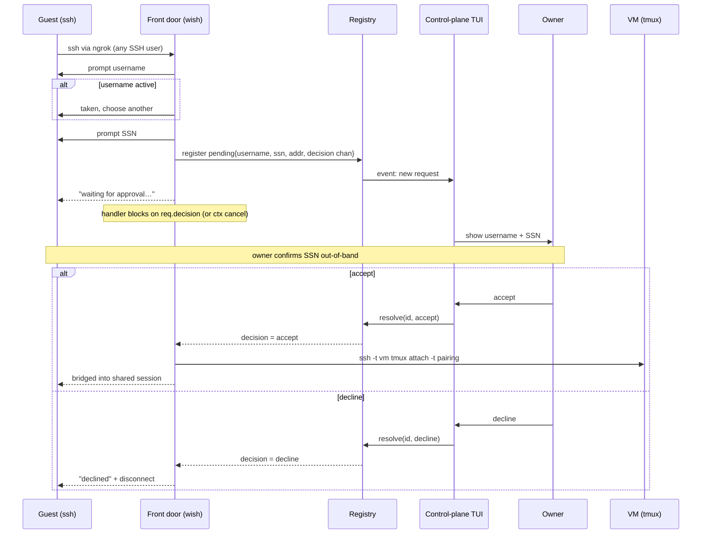
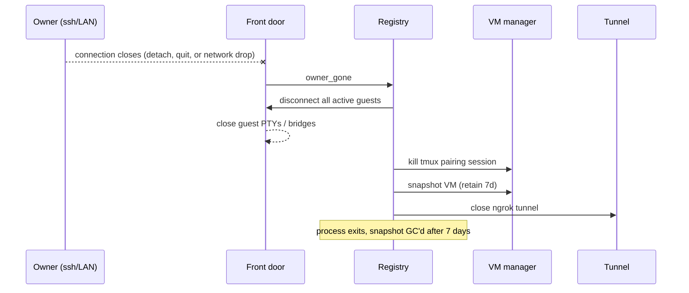
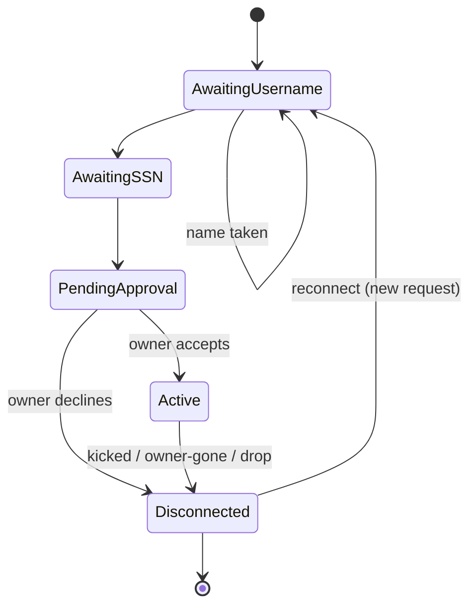

# social-shecurity — Technical Design

Engineering design for the PRD in [`PRD.md`](./PRD.md).

**Status:** draft · **Scope:** single-host owner tool that lets guests `ssh` into a
shared, sandboxed pairing session with a "social security" trust model.

---

## 1. Summary

The owner runs one binary in any directory on their dev machine. It boots a NixOS
VM seeded with that directory's contents (respecting `.gitignore`), opens an ngrok
TCP tunnel, and runs an SSH front door. Guests connect with a stock `ssh` client,
pick a username, enter an SSN (an out-of-band matching token, not a validated
secret), and wait for the owner to accept. Accepted guests are bridged into a
shared tmux session running *inside the VM*. When the owner's connection ends,
everyone is disconnected, the working directory is written back to the host, and
the VM is snapshotted for 7 days.

## 2. Goals / non-goals

**Goals (from PRD)**
- Guests need nothing but `ssh`.
- All command execution is sandboxed in a NixOS VM (no command/network limits inside).
- Shared read/write tmux session for real pair programming.
- Owner-mediated join (accept/decline) keyed by an out-of-band SSN.
- The project is any directory (git optional); reintegration writes the working
  directory back to the host, and additionally `git push`es when a remote exists.
- Session ends when the owner disconnects (including transient drops).

**Non-goals**
- Defending against a malicious *accepted* guest (trust is social).
- Credential exfiltration by an accepted guest (explicitly out of threat model).
- Multi-host / multi-owner / horizontal scale.
- Copying files excluded by `.gitignore` into the sandbox.

## 3. Tech stack

| Concern            | Choice                                   | Why |
|--------------------|------------------------------------------|-----|
| Language           | Go                                       | Matches `wish` + `ngrok-go`; single static binary. |
| SSH front door     | `charmbracelet/wish`                     | SSH server as middleware; PTY handling; accept any username. |
| Public ingress     | `golang.ngrok.com/ngrok/v2`              | TCP endpoint as a `net.Listener`, no separate `ngrok` process. |
| Control-plane UI   | `charmbracelet/bubbletea`                | TUI in the launching terminal: user list, requests, accept/decline/kick. |
| Sandbox            | NixOS VM (QEMU/KVM)                       | "No command limits without harming host" needs true VM isolation. |
| VM definition      | this repo's flake (`nixosConfigurations`)| Reuse the existing flake; `microvm.nix`/`nixos-generators` for fast boot. |
| Shared shell       | `tmux` inside the VM                      | Shared read/write session; owner-detach = session end. |

## 4. High-level architecture

```
                          ┌──────────────────────── HOST (owner's dev machine) ───────────────────────┐
                          │                                                                           │
   guest `ssh`            │   ngrok-go net.Listener        ┌─────────────────────────────────────┐    │
   client  ───────────────────►  (public TCP endpoint) ───►│  SSH front door (wish)              │    │
   (internet)   ngrok     │                                │  - accept any SSH user              │    │
                          │                                │  - prompt username + SSN            │    │
                          │   LAN net.Listener             │  - register pending join request    │    │
   owner `ssh` ───────────────►  (loopback/LAN only) ─────►│  - on accept: bridge PTY ⇄ VM tmux  │    │
   client (LAN)           │                                └──────────────┬──────────────────────┘    │
                          │                                               │ events / decisions        │
                          │   ┌──────────────────────┐     ┌──────────────▼───────────────────────┐   │
                          │   │  Control-plane TUI   │◄───►│  Session registry (in-memory)        │   │
   owner's terminal ◄─────────┤  (bubbletea)         │     │  pending[], active[], owner presence │   │
   (launched here)        │   │  list / accept /     │     └──────────────┬───────────────────────┘   │
                          │   │  decline / kick      │                    │ ssh over host-only net    │
                          │   └──────────────────────┘    ┌───────────────▼──────────────────────┐    │
                          │                               │  NixOS VM (QEMU/KVM)                 │    │
                          │   ┌──────────────────────┐    │  - sshd on host-only iface           │    │
                          │   │  Tunnel manager      │    │  - tmux session "pairing"            │    │
                          │   │  (ngrok lifecycle)   │    │  - project copy (respects .gitignore)│    │
                          │   └──────────────────────┘    │  - NAT egress (no network limits)    │    │
                          │   ┌──────────────────────┐    └──────────────────────────────────────┘    │
                          │   │  VM manager          │  boot / readiness / snapshot(7d) / destroy     │
                          │   └──────────────────────┘                                                │
                          └───────────────────────────────────────────────────────────────────────────┘
```

**Trust boundary:** the wish front door on the host is the only thing guests touch on
the host. Guests never get a host shell — the bridge only ever attaches them to tmux
*inside the VM*. Everything a guest can run is confined to the VM.

## 5. Components

- **cmd/sssh** — entrypoint. Resolves the working directory (the project), wires the
  managers, owns the top-level context and graceful teardown.
- **VM manager** — builds/boots the NixOS VM, waits for sshd readiness, seeds the
  working dir (respecting `.gitignore`) plus optional git creds, writes the dir back
  to the host on teardown, snapshots the VM, GCs snapshots older than 7 days.
- **Tunnel manager** — creates the ngrok TCP listener, surfaces the public address to
  the control-plane, closes on teardown.
- **SSH front door (wish)** — two listeners: ngrok (guests) and LAN (owner). Runs the
  join ceremony, produces `net.Conn`/PTY, and bridges accepted sessions into the VM.
- **Session registry** — concurrency-safe in-memory state (pending requests, active
  users, owner presence). Single source of truth; emits events to the TUI.
- **Control-plane TUI** — renders connection instructions (the ngrok address), the
  live user list, and pending requests; handles accept/decline/kick keybindings.
- **Bridge** — pipes an accepted guest's PTY to `ssh -t <vm> tmux attach -t pairing`
  over the host-only network; tears the pipe down on kick/teardown.

## 6. Key flows

### 6.1 Guest join



### 6.2 Session teardown (owner disconnect / detach / transient drop)



### 6.3 Guest connection state machine



## 7. Session registry (state)

```
Session
  project     string          // working directory (git optional)
  vm          VMHandle        // qemu pid, host-only IP, ssh key
  tunnel      Addr            // ngrok public host:port
  owner       *Conn           // nil until owner attaches; close ⇒ teardown
  pending     map[id]Request  // in-flight join requests awaiting a decision
  active      map[name]*Conn  // name ⇒ live bridged guest
  mu          sync.Mutex
  events      chan Event      // → control-plane TUI

Request
  username    string
  ssn         string
  remoteAddr  string
  ptyReq      PTY             // the guest's terminal, held while blocked
  decision    chan Decision   // buffered(1); front-door goroutine blocks here
```

The `decision` channel is the rendezvous between the TUI and the blocked front-door
goroutine: `registry.Resolve(id, d)` sends on it, waking exactly that guest's handler
(see §6.1). The handler `select`s on `decision` and `ctx.Done()`, so a guest disconnect
or timeout while pending also unblocks it and drops the request.

Username uniqueness is enforced against `active` (and `pending`). Kick removes from
`active` and cancels the connection's context (closing the bridge); the guest may
reconnect as a fresh pending request.

## 8. Networking

- **Guest ingress:** ngrok TCP endpoint → `net.Listener` on the host. Guests only ever
  reach the wish front door.
- **Owner ingress:** a separate listener bound to loopback/LAN. ngrok is the *only*
  public path, so LAN origin approximates "owner" (see open questions).
- **Host ⇄ VM:** host-only virtual NIC; host holds an SSH key for the VM's sshd. Used
  only to attach tmux for accepted guests.
- **VM egress:** NAT to the internet (QEMU user-net or tap+NAT) — "no network limits"
  inside the VM, and enables `git push` to upstream.

## 9. Sandbox / VM

- **Definition:** extend this repo's flake with a `nixosConfiguration` for the sandbox
  (sshd, tmux, git, dev tools). Boot via QEMU/KVM. Evaluate `microvm.nix` or
  `nixos-generators` if cold-boot latency is too high.
- **Project seeding:** copy the working directory into the VM, respecting `.gitignore`
  when present (skips ignored build artifacts, secrets, `node_modules`, etc.); if the
  directory isn't a git repo and has no `.gitignore`, copy it wholesale. No host mount
  → the VM stays isolated during the session.
- **Reintegration:** on teardown, write the VM's working directory back to the host.
  Land it in a sibling `sssh-out/` rather than clobbering the source in place (open q.).
  If the project is a git repo with a remote, `git push` is additionally available
  during the session.
- **Credentials:** when the project is a git repo, owner git creds are placed in the VM
  (per PRD; exfiltration is out of the threat model) so any participant can commit and
  push as they go. Non-git projects need no creds.
- **Retention:** on teardown, snapshot the VM disk and keep it 7 days; a GC pass on
  startup removes older snapshots.

## 10. Lifecycle & failure handling

| Event                         | Behavior |
|-------------------------------|----------|
| ngrok fails to open           | Abort startup with a clear error; nothing exposed. |
| VM fails to boot / no sshd    | Abort startup; report; no tunnel opened. |
| Tunnel drops mid-session      | Guests drop; attempt re-listen, else teardown. *(open q.)* |
| Owner connection drops        | Full teardown (PRD: transient drop ends session). |
| Guest drops                   | Remove from `active`; free the username; session continues. |
| Kick                          | Close bridge + PTY; guest may reconnect. |

## 11. Open questions

1. **Owner identity.** Is "connected via LAN" sufficient to grant owner powers, or do
   we need a one-time token printed at startup? On a shared LAN, anyone could reach the
   LAN listener. Simplest hardening: bind owner listener to loopback + require the
   startup token.
2. **Control-plane ergonomics.** Control-plane lives in the launching terminal while
   the owner pair-programs over a *separate* SSH session. Is two-surface acceptable, or
   should accept/decline/kick be reachable from inside tmux (keybinding / small CLI)?
3. **Username source.** Interactive prompt (allows reprompt on collision, per PRD line
   16) vs. the SSH username (`ssh alice@endpoint`, but collision means reconnect). Design
   assumes interactive prompt; confirm.
4. **SSN semantics.** Purely displayed for out-of-band matching — any format/length
   rules? What if two pending requests share an SSN?
5. **VM boot latency.** Cold-booting NixOS per session may take tens of seconds. Is that
   acceptable, or do we pre-warm / use microVMs?
6. **Host ⇄ VM bridge.** `ssh into VM` (recommended) vs. virtio console vs. sharing the
   tmux socket over virtiofs. Confirm ssh-into-VM.
7. **Project capture fidelity.** `.gitignore` is the copy boundary, but edge cases remain:
   non-git dirs with no `.gitignore` (copy-all could be huge), symlinks, submodules, and a
   size cap to refuse pathological trees.
8. **Write-back target.** Land the returned working dir in a sibling `sssh-out/` (safe, but
   the owner must merge) or back in place (convenient, but clobbers host edits made during
   the session)? How are conflicts surfaced?
9. **Terminal sizing.** A shared session clamps all clients to the smallest terminal.
   Acceptable for pairing, or do we want per-client windows (drops the single-screen model)?
10. **Concurrency limit.** Max simultaneous guests?
11. **Host-key churn.** Ephemeral ngrok address ⇒ guests get SSH host-key warnings each
    session. Ship a persistent host key + a note in the connect instructions?
12. **Tunnel-drop policy.** Re-listen and keep the session, or treat as teardown?
13. **Snapshot storage.** Where do 7-day snapshots live, and what's the disk budget?
```
