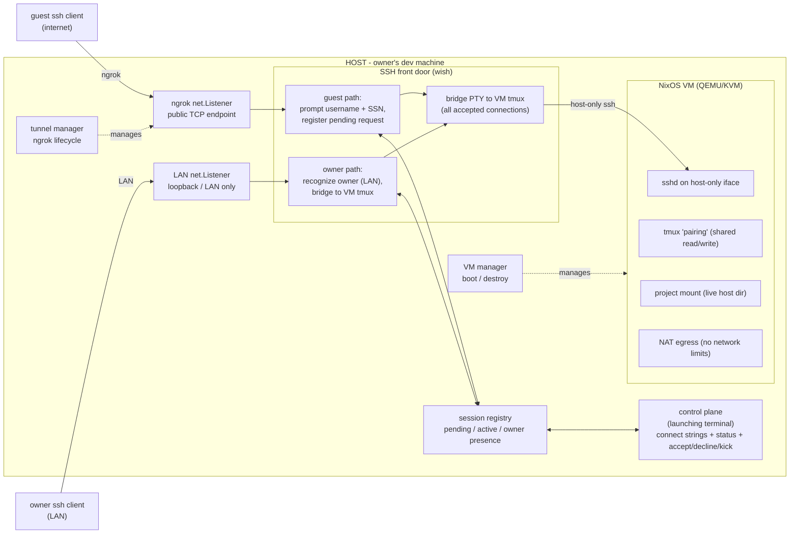
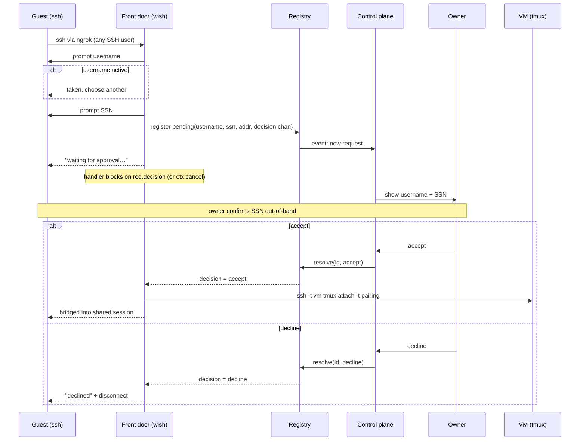
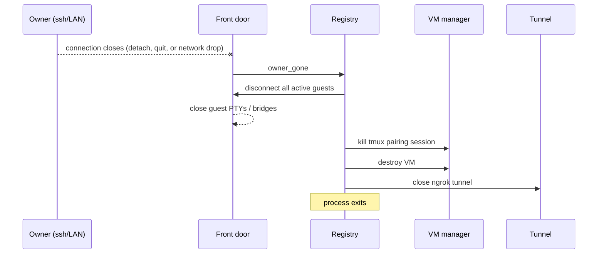
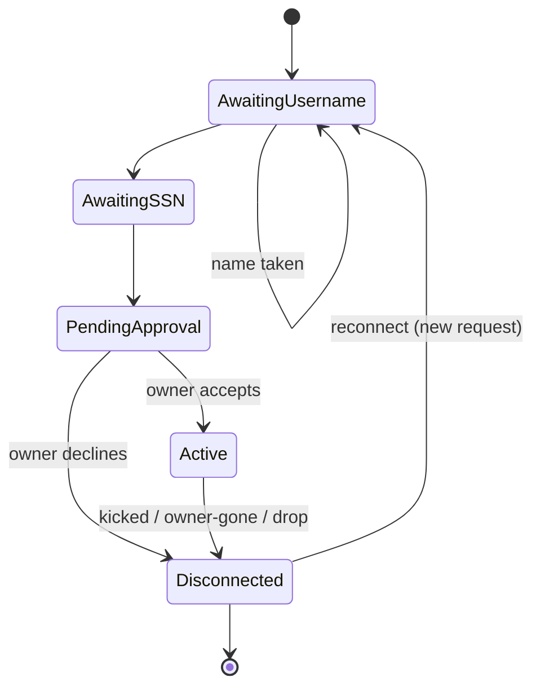

# social-shecurity — Technical Design

Engineering design for the PRD in [`PRD.md`](./PRD.md).

**Status:** draft · **Scope:** single-host owner tool that lets guests `ssh` into a
shared, sandboxed pairing session with a "social security" trust model.

---

## 1. Summary

The owner runs one binary in any directory on their dev machine. It boots a NixOS
VM — composed from the owner's host environment and the project's own toolchain —
with that directory mounted live from the host, opens an ngrok
TCP tunnel, and runs an SSH front door. Guests connect with a stock `ssh` client,
pick a username, enter an SSN (an out-of-band matching token, not a validated
secret), and wait for the owner to accept. Accepted guests are bridged into a
shared tmux session running *inside the VM*. When the owner's connection ends,
everyone is disconnected and the VM is destroyed; project edits are already on
the host, since the directory was mounted live.

## 2. Goals / non-goals

**Goals (from PRD)**
- Guests need nothing but `ssh`.
- All command execution is sandboxed in a NixOS VM (no command/network limits inside).
- Shared read/write tmux session for real pair programming.
- Owner-mediated join (accept/decline) keyed by an out-of-band SSN.
- The project is any directory (git optional); its directory is mounted live from
  the host. When it is a git repo, participants can commit — authored by the owner,
  co-authored by the connected users — while `git push` is disabled for everyone.
- Session ends when the owner disconnects (including transient drops).
- The sandbox carries the project's own toolchain (from its flake) so pairs can
  build, run, and test with the project's compilers, LSPs, and tools.
- The sandbox reuses the owner's host environment (editor, shell, tmux) so the
  shared session feels native rather than generic.

**Non-goals**
- Defending against a malicious *accepted* guest (trust is social).
- Credential exfiltration by an accepted guest (explicitly out of threat model).
- Multi-host / multi-owner / horizontal scale.

## 3. Tech stack

| Concern            | Choice                                   | Why |
|--------------------|------------------------------------------|-----|
| Language           | Go                                       | Matches `wish` + `ngrok-go`; single static binary. |
| SSH front door     | `charmbracelet/wish`                     | SSH server as middleware; PTY handling; accept any username. |
| Public ingress     | `golang.ngrok.com/ngrok/v2`              | TCP endpoint as a `net.Listener`, no separate `ngrok` process. |
| Control plane      | `charmbracelet/bubbletea`                | Interactive control UI in the launching terminal: connect strings, status, accept/decline/kick (host-side; guests never see it). |
| Sandbox            | NixOS VM (QEMU/KVM)                       | "No command limits without harming host" needs true VM isolation. |
| VM base            | this repo's flake (`nixosConfigurations`)| Stable base module: sshd, tmux, keys, firewall-off. `microvm.nix`/`nixos-generators` if cold-boot is slow. |
| Owner environment  | host NixOS program modules               | Reuse the owner's editor/shell/tmux so the session is native, not generic. |
| Project toolchain  | project flake `devShell` (`nix develop`/direnv) | Per-project compilers/LSPs; host Nix store shared over 9p keeps it fast. |
| Shared shell       | `tmux` inside the VM                      | Shared read/write session; owner-detach = session end. |

## 4. High-level architecture



**Trust boundary:** the wish front door on the host is the only thing guests touch on
the host. Guests never get a host shell — the bridge only ever attaches them to tmux
*inside the VM*. Everything a guest can run is confined to the VM. The owner's control
plane runs in the launching terminal — a separate host-side process guests never
connect to — so it is both invisible to guests and unreachable by them.

## 5. Components

- **cmd/sssh** — entrypoint. Resolves the working directory (the project), wires the
  managers, owns the top-level context and graceful teardown.
- **VM manager** — builds/boots the NixOS VM (composed from the base module, the
  owner's host environment modules, and — when the project has a flake — its
  `devShell` entered via `nix develop`), waits for sshd readiness, mounts the
  project directory read/write and, for a git repo, seeds the owner's git identity
  (the commit author) without any push credentials, and destroys the VM on
  teardown.
- **Tunnel manager** — creates the ngrok TCP listener, surfaces the public address to
  the control plane, closes on teardown.
- **SSH front door (wish)** — two listeners: ngrok (guests) and LAN (owner). Runs the
  join ceremony, produces `net.Conn`/PTY, and bridges accepted sessions into the VM.
  The owner connection is recognized by LAN origin and bridged into the VM tmux like
  any other session — no in-band interception; management lives in the control plane.
- **Session registry** — concurrency-safe in-memory state (pending requests, active
  users, owner presence). Single source of truth; emits events to the control plane.
- **Control plane** — the launching terminal (host-side, interactive): prints the
  guest and owner connect strings, shows connected/waiting counts and the pending
  request list, and handles accept/decline/kick. A separate process guests never
  connect to.
- **Bridge** — pipes an accepted guest's PTY to `ssh -t <vm> tmux attach -t pairing`
  over the host-only network; tears the pipe down on kick/teardown.
- **Commit helper** — a standalone program that generates and parses the git commit
  template from the currently connected users (read from the registry). It owns the
  SSH-username → git-identity (username + email) mapping: on generate it emits a
  `Co-authored-by: <username> <email>` line per connected user; on parse it reads a
  completed commit to learn a user's email (captured on their first commit) and records
  it against their SSH username for reuse. Invoked from the VM's git template/hook so
  co-authorship tracks the live participant set.

## 6. Key flows

### 6.1 Guest join



### 6.2 Session teardown (owner disconnect / detach / transient drop)



### 6.3 Guest connection state machine



### 6.4 Owner control surface (UX)

The owner has two surfaces: the **launching terminal (Terminal A)** is the interactive
control plane; the owner's **SSH session (Terminal B)** is the shared editor. Control
and code are cleanly separated — no in-band key interception, nothing painted over the
editor.

1. **Launch (Terminal A, control plane).** `sssh` in the project dir boots the VM,
   opens the tunnel, and prints two connect strings (guest + owner). It stays
   interactive as the control plane: status (connected/waiting counts) plus the pending
   request list the owner acts on.
2. **Enter (Terminal B, the session).** In another terminal the owner runs the printed
   `ssh` command over loopback/LAN. The front door recognizes the owner by LAN origin
   and drops them straight into the shared VM tmux — nothing painted over it; owner and
   guests see the same screen.

   ```
   ┌ shared tmux (everyone mirrored) ────────────────────────┐
   │ $ vim main.go                                           │
   │ …                                                       │
   └─────────────────────────────────────────────────────────┘
   ```
3. **A request arrives (ambient).** A guest connects and enters username + SSN.
   Terminal A's status updates (`1 waiting: bob`) with a soft bell; Terminal B's editor
   is untouched.
4. **Act (Terminal A).** The owner switches to the control plane:

   ```
   ┌ sssh control ───────────────────────────────┐
   │ pending                                      │
   │  ▸ bob   SSN 867-5309   from 73.x.x.x        │
   │ connected                                    │
   │    alice   idle 0:12                         │
   │    carol   active                            │
   │ [a]ccept  [d]ecline  [k]ick  [q]uit          │
   └──────────────────────────────────────────────┘
   ```

   The owner confirms bob's SSN out-of-band, presses `a`; bob is bridged into the shared
   session.
5. **End.** The owner disconnects Terminal B (detach/quit) or quits the control plane in
   Terminal A → teardown (§6.2).

**Design commitments:** control lives in a separate process (the launching terminal), so
it never competes with tmux for keystrokes or paints over the shared editor, and it is
both invisible to guests and unreachable by them (§4 trust boundary).

## 7. Session registry (state)

```
Session
  project     string          // working directory (git optional)
  vm          VMHandle        // qemu pid, host-only IP, ssh key
  tunnel      Addr            // ngrok public host:port
  owner       *Conn           // nil until owner attaches; close ⇒ teardown
  pending     map[id]Request  // in-flight join requests awaiting a decision
  active      map[name]*Conn  // name ⇒ live bridged guest
  mu          sync.Mutex
  events      chan Event      // → control-plane TUI

Request
  username    string
  ssn         string
  remoteAddr  string
  ptyReq      PTY             // the guest's terminal, held while blocked
  decision    chan Decision   // buffered(1); front-door goroutine blocks here
```

The `decision` channel is the rendezvous between the TUI and the blocked front-door
goroutine: `registry.Resolve(id, d)` sends on it, waking exactly that guest's handler
(see §6.1). The handler `select`s on `decision` and `ctx.Done()`, so a guest disconnect
or timeout while pending also unblocks it and drops the request.

Username uniqueness is enforced against `active` (and `pending`). Kick removes from
`active` and cancels the connection's context (closing the bridge); the guest may
reconnect as a fresh pending request.

## 8. Networking

- **Guest ingress:** ngrok TCP endpoint → `net.Listener` on the host. Guests only ever
  reach the wish front door.
- **Owner ingress:** a separate listener bound to loopback/LAN. ngrok is the *only*
  public path, so LAN origin approximates "owner" (see open questions).
- **Host ⇄ VM:** host-only virtual NIC; host holds an SSH key for the VM's sshd. Used
  only to attach tmux for accepted guests.
- **VM egress:** NAT to the internet (QEMU user-net or tap+NAT) — "no network limits"
  inside the VM. `git push` stays disabled regardless (§9), so egress serves builds,
  tests, and fetches, not pushing.

## 9. Sandbox / VM

The sandbox is **composed**, not a fixed image. It is assembled from three layers,
the base applied last so its security-critical settings win:

1. **Base** (`sandbox/configuration.nix`) — sshd (key-only), the `pairing` tmux
   service, authorized-keys staging, firewall off. Always present; overrides the
   layers below where they collide (`lib.mkForce`).
2. **Owner environment** — the owner's host editor/shell/tmux configuration, so the
   shared session uses the owner's real setup rather than a generic one.
3. **Project toolchain** — when the project defines a flake `devShell`, the pairing
   panes run inside it, so compilers, LSPs, and tests match the project.

- **Base + owner environment.** The host is NixOS; its editor/shell/tmux live in
  declarative modules (`programs.neovim`, `programs.tmux`, `programs.zsh`), not
  dotfiles. The sandbox `nixosConfiguration` imports those modules — only the
  environment layer, never the host's bootloader, hardware, users, or secrets. It
  imports the host paths directly for now; factoring that layer into a module shared
  by host and sandbox is a separate, non-blocking goal (PLAN §Side goals). Boot via
  QEMU/KVM; evaluate `microvm.nix`/`nixos-generators` if cold-boot latency is too high.
- **Project toolchain.** The VM base stays stable across projects; only the shell
  environment varies. `qemu-vm.nix` shares the host Nix store over 9p, so anything the
  owner has already built (`nix develop`/direnv) resolves instantly in the VM; only
  uncached inputs build at session start. The pairing panes enter the project's dev
  environment via `nix develop` / a `use flake` `.envrc` (the host already standardizes
  on `direnv`). A project with no flake falls back to the base tools.
- **Trust.** Only the owner's own project is ever evaluated — nothing a guest supplies
  is. The project pins its own nixpkgs, independent of sssh's flake, so inheriting the
  flake is faithful.
- **Project mount:** mount the host project directory into the VM read/write (9p
  today; virtiofs if perf or file-watching semantics bite). Edits are live on the
  host, so there is no copy-in, no write-back, and no `sssh-out/`. This is the
  deliberate exception to VM isolation: the system is sandboxed, the project
  directory is shared. When the project is a git repo, participants commit locally;
  `git push` is disabled for everyone (see Git identity below).
- **Git identity & commits:** when the project is a git repo, the VM's git config is
  seeded with the owner's identity, so every commit is authored by the owner (per PRD:
  the owner's identity is part of the VM). Co-authorship runs through a git commit
  template driven by the **commit helper** (§5): it generates a
  `Co-authored-by: <username> <email>` line for each connected user, and parses each
  commit to learn a user's email — captured on their first commit (a session with no
  commits never asks) and remembered against their SSH username, so later commits reuse
  it without reprompting. Push is disabled for everyone: no push credentials enter the
  VM, and a pre-push hook rejects pushes, so the prohibition is explicit rather than
  incidental. Non-git projects need no git setup.
- **Teardown:** the VM is destroyed on session end. Nothing is retained: the project
  lives on the host (mounted live), so there is no VM state worth keeping.

## 10. Lifecycle & failure handling

| Event                         | Behavior |
|-------------------------------|----------|
| ngrok fails to open           | Abort startup with a clear error; nothing exposed. |
| VM fails to boot / no sshd    | Abort startup; report; no tunnel opened. |
| Tunnel drops mid-session      | Guests drop; attempt re-listen, else teardown. *(open q.)* |
| Owner connection drops        | Full teardown (PRD: transient drop ends session). |
| Guest drops                   | Remove from `active`; free the username; session continues. |
| Kick                          | Close bridge + PTY; guest may reconnect. |

## 11. Open questions

1. **Owner identity.** Resolved: the first connection to claim the owner slot is the
   owner (bridged straight in, no ceremony); every later connection is a guest. The slot
   is freed on owner disconnect. This assumes the owner connects first over the LAN; a
   one-time startup token remains an option if that assumption needs hardening.
2. **Username source.** Resolved: the ceremony prompts interactively, defaulting to the
   SSH username (`ssh alice@endpoint`) and allowing an override, so a collision is a
   reprompt rather than a reconnect.
3. **SSN semantics.** Purely displayed for out-of-band matching — any format/length
   rules? What if two pending requests share an SSN?
4. **VM boot latency.** Cold-booting NixOS per session may take tens of seconds, and the
   first uncached `nix develop` for a project adds to that. Is that acceptable, or do we
   pre-warm / use microVMs / prebuild the project devShell?
5. **Host ⇄ VM bridge.** `ssh into VM` (recommended) vs. virtio console vs. sharing the
   tmux socket over virtiofs. Confirm ssh-into-VM.
6. **Project-mount backend.** 9p is wired today; a writable working directory stresses
   mmap, file locking, and inotify (watchers, LSPs) and is slow on metadata. Move to
   virtiofs (needs a `virtiofsd` per session), or is 9p good enough?
7. **Terminal sizing.** A shared session clamps all clients to the smallest terminal.
   Acceptable for pairing, or do we want per-client windows (drops the single-screen model)?
8. **Concurrency limit.** Max simultaneous guests?
9. **Host-key churn.** Resolved for the front door: it presents a persistent host key
   (stored under the user config dir, generated on first use), so the owner's stable
   `localhost:<port>` entry no longer mismatches across runs. A guest-facing note for
   the changing ngrok address remains open (M3).
10. **Tunnel-drop policy.** Re-listen and keep the session, or treat as teardown?
11. **Join-request expiry.** If the owner is heads-down, should a pending request
    auto-expire (and notify the guest) after a timeout, or wait indefinitely?
12. **nixpkgs skew.** The host is channel-based; sssh is a flake pinned to `nixos-26.05`.
    Importing host modules risks evaluating against two nixpkgs. Match versions, or
    resolve via the shared-module side goal (PLAN §Side goals).
13. **Import boundary.** How much of the host config to inherit — just the editor/shell/
    tmux program modules, or the whole home-manager user? Where is the line drawn?
14. **Non-NixOS owner.** Owner-environment inheritance assumes a NixOS host. What is the
    fallback (dotfile copy? base tools only?) for a non-NixOS owner?
15. **Commit helper placement & email prompt.** The helper reads the connected set from
    the host registry, but the template is applied where git runs (the VM). Does it run
    host-side (invoked over the host↔VM channel) or in the VM (with the connected set
    pushed in)? And on a user's first commit, how is the email actually elicited — an
    interactive prompt, or a placeholder line the user edits in the message?
16. **Push enforcement.** Withholding credentials stops a credentialed push, but a
    forwarded SSH agent or ambient auth could still reach a remote. Is a pre-push hook
    (or a fetch-only remote rewrite) enough to guarantee "push revoked for everyone"?
```
